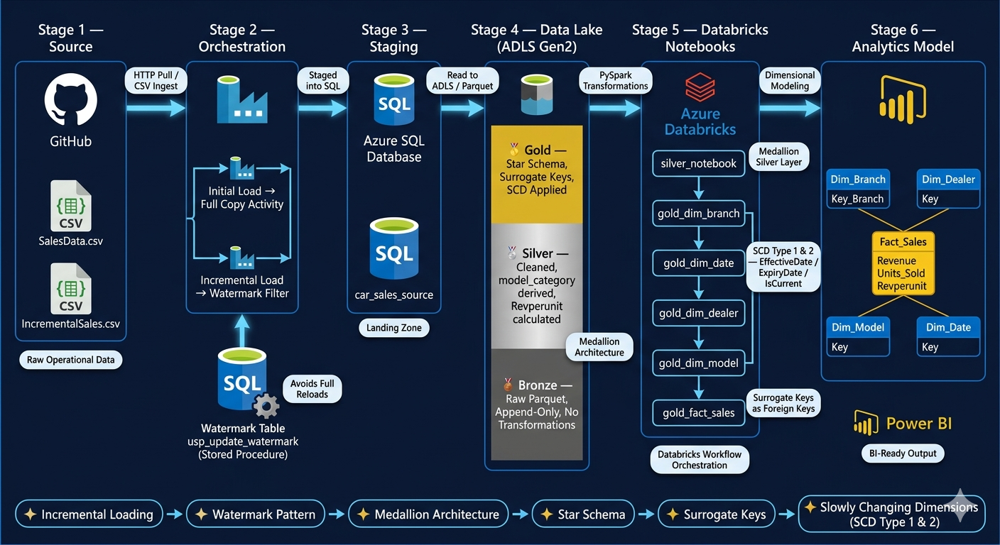
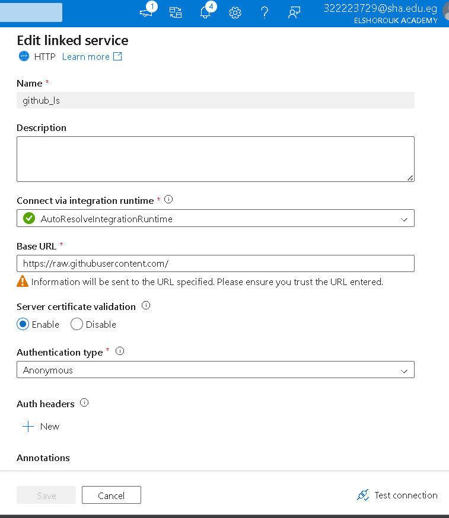
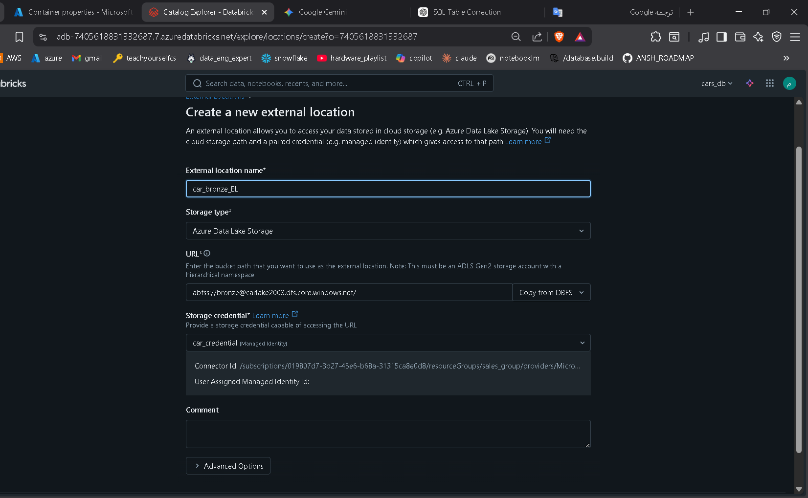
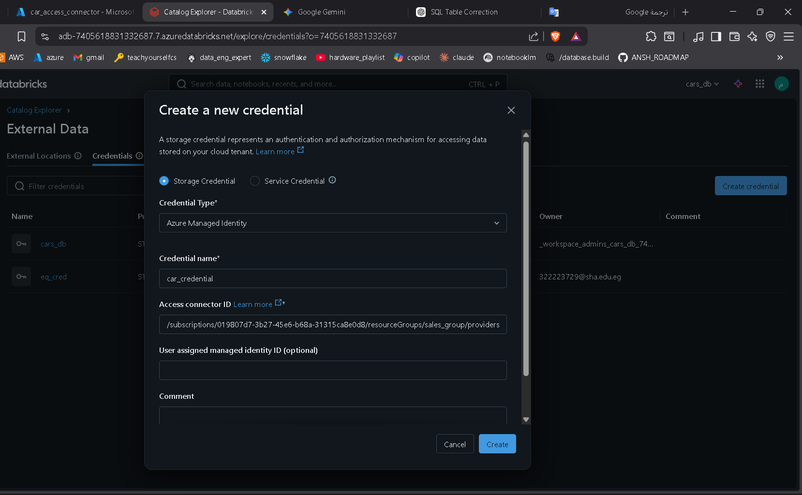
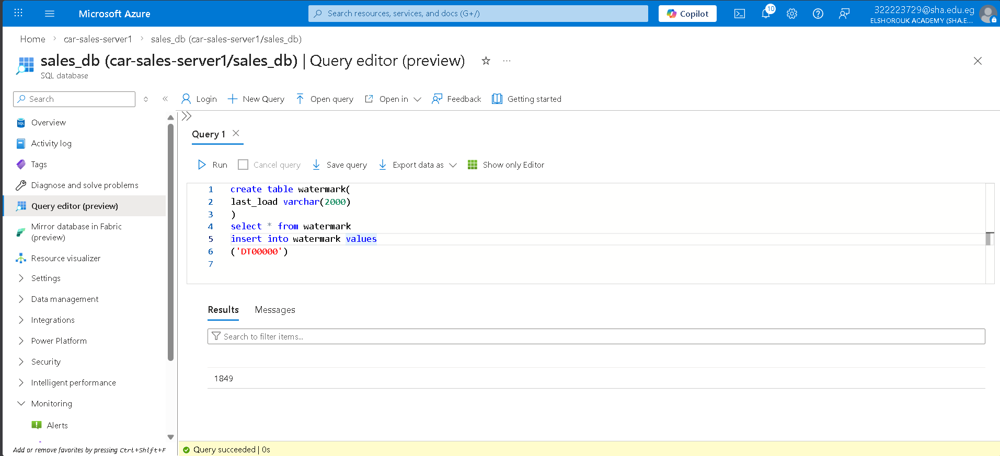
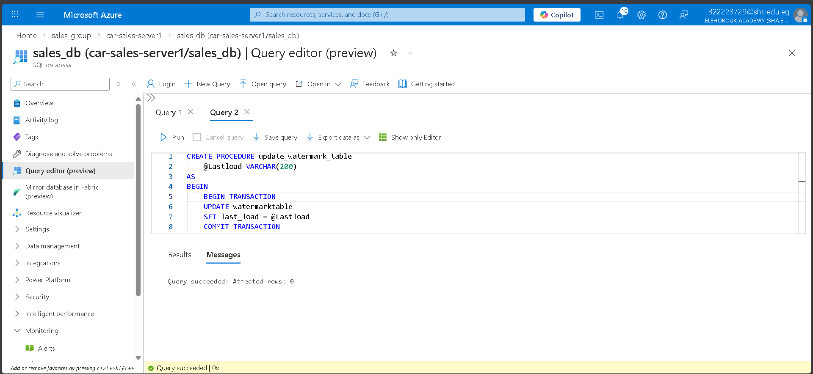
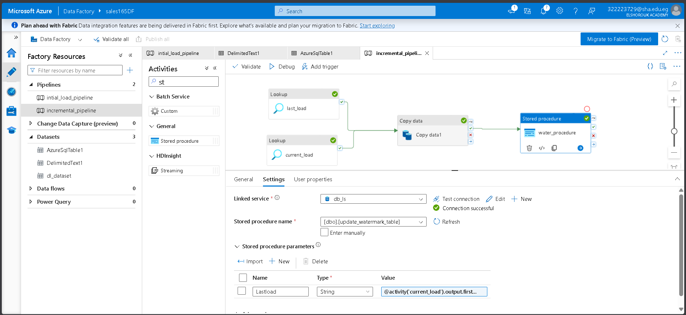
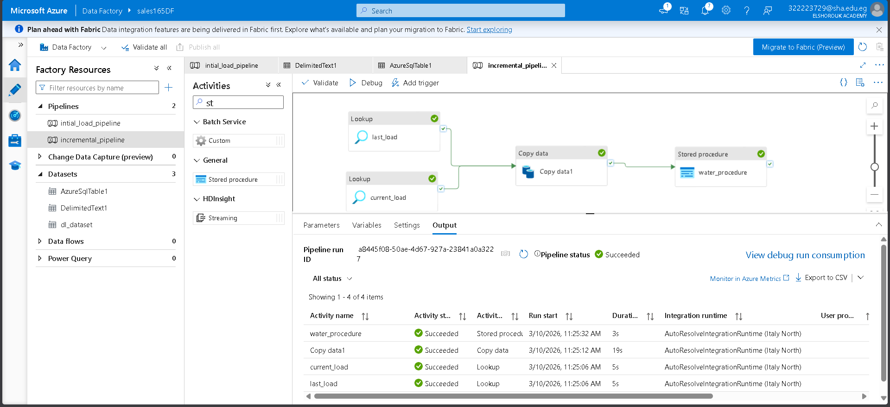
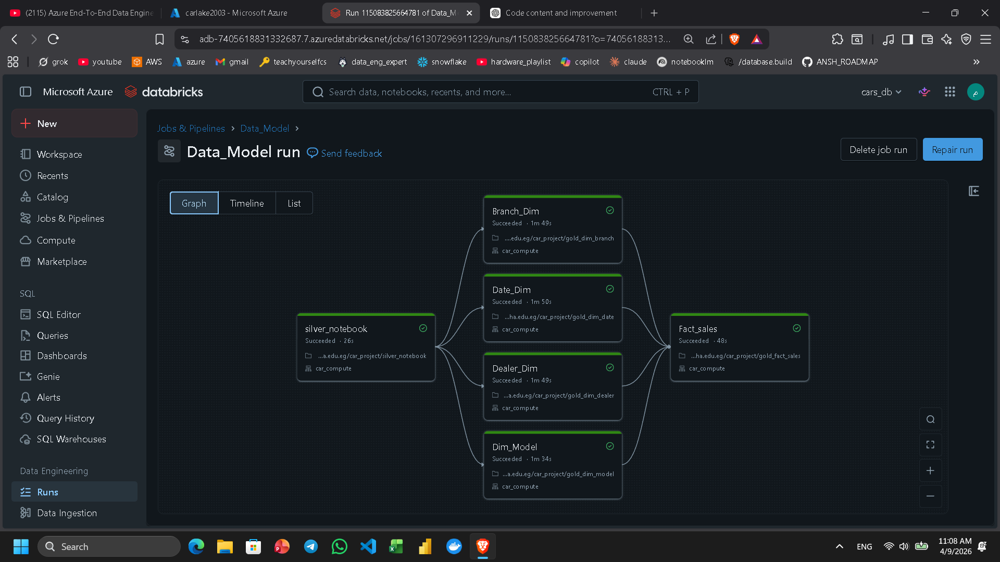

# 🚀 Azure Sales Data Engineering Project

> **An end-to-end Azure data engineering pipeline** that ingests raw sales data, processes it through a Medallion architecture (Bronze → Silver → Gold), and delivers a clean star-schema analytical model ready for BI reporting.

---

## 📌 Table of Contents

- [Business Problem & Solution](#-business-problem--solution)
- [Project Overview](#-project-overview)
- [Architecture](#-architecture)
- [Data Engineering Techniques](#-data-engineering-techniques)
- [Technologies Used](#-technologies-used)
- [Folder Structure](#-folder-structure)
- [Pipeline Walkthrough](#-pipeline-walkthrough)
  - [1. Initial Load Pipeline](#1-initial-load-pipeline)
  - [2. Incremental Load Pipeline](#2-incremental-load-pipeline)
  - [3. Silver Layer Transformation](#3-silver-layer-transformation)
  - [4. Gold Layer Modeling](#4-gold-layer-modeling)
  - [5. Databricks Workflow Orchestration](#5-databricks-workflow-orchestration)
- [Star Schema Model](#-star-schema-model)
- [Business Value](#-business-value)
- [How to Run](#-how-to-run)

---

## 🔴 Business Problem & Solution

### The Problem

Car dealership networks operate across multiple **branches**, **dealers**, and **vehicle model lines** — each generating daily sales transactions. In most organizations at this stage, this data lives in raw operational systems and CSV exports with no unified view. This creates serious pain points:

| Pain Point | Impact |
|------------|--------|
| **Scattered, siloed data** | Sales data is spread across branches with no single source of truth |
| **No historical tracking** | When a dealer's name or branch changes, old records are overwritten — losing history |
| **Full reloads on every refresh** | Without an incremental strategy, re-ingesting all data daily is slow, costly, and wasteful |
| **Raw data is not analytics-ready** | Operational columns like `Model_ID = "SUV-001"` mean nothing to a business analyst |
| **No consistent metrics** | KPIs like revenue per unit, monthly trends, and model performance are calculated ad-hoc in spreadsheets — inconsistently |
| **BI tools can't query raw data efficiently** | Flat transactional tables are too slow and unstructured for dashboards and slice-and-dice analysis |

> Without a proper data engineering pipeline, the business is flying blind — unable to answer questions like *"Which dealer drove the most revenue last quarter?"* or *"Which car category is declining?"* with confidence or speed.

---

### The Solution — What This Project Does

This project builds a **modern cloud data pipeline on Azure** that solves each of these problems end to end:

```
PROBLEM                             SOLUTION APPLIED
──────────────────────────────────────────────────────────────────────────
Scattered raw CSV data          →   Azure Data Factory ingests & centralizes
Full reloads every refresh      →   Watermark-based incremental loading
No history on dimension changes →   Slowly Changing Dimensions (SCD Type 1 & 2)
Raw IDs not meaningful          →   Silver layer derives model_category, Revperunit
No consistent KPIs              →   Gold layer bakes metrics into Fact_Sales
BI tools can't query raw data   →   Star Schema with surrogate keys for fast joins
No orchestration or order       →   Databricks Workflow ensures correct run order
```

By the end of the pipeline, a Power BI developer or analyst can connect directly to the Gold layer and immediately answer business questions — with no manual SQL, no spreadsheet gymnastics, and no guesswork.

---

## 📖 Project Overview

This project demonstrates a **production-style data engineering workflow** built entirely on Azure services. It simulates a real-world scenario where raw operational car sales data is:

1. Ingested from CSV source files into **Azure SQL Database** via **Azure Data Factory**
2. Incrementally refreshed using a **watermark-based strategy**
3. Transformed through **Bronze → Silver → Gold** layers in **Azure Databricks**
4. Modeled into a **star schema** with Fact and Dimension tables
5. Made ready for consumption by **Power BI** or any other BI tool

The project highlights both engineering best practices (incremental loading, medallion architecture, reusable notebooks) and a clean analytical output model.

---

## 🏗 Architecture

```
┌─────────────┐     ┌─────────────────────┐     ┌───────────────────┐
│  GitHub     │────▶│  Azure Data Factory  │────▶│  Azure SQL        │
│  CSV Files  │     │  (Copy Activity)     │     │  Database         │
└─────────────┘     └─────────────────────┘     └────────┬──────────┘
                                                          │
                                                          ▼
                                               ┌──────────────────────┐
                                               │   ADLS Gen2          │
                                               │   (Bronze / Raw)     │
                                               └────────┬─────────────┘
                                                        │
                              ┌─────────────────────────┼──────────────────────────┐
                              ▼                         ▼                          ▼
                    ┌──────────────────┐    ┌───────────────────┐    ┌─────────────────────┐
                    │  Silver Layer    │    │   Gold Layer       │    │  Analytics Model    │
                    │  (Cleaned Data)  │───▶│  (Star Schema)    │───▶│  Power BI / Reports │
                    └──────────────────┘    └───────────────────┘    └─────────────────────┘
```

### Data Flow Summary

| Stage | Tool | Description |
|-------|------|-------------|
| **Source** | GitHub | Raw CSV files (`SalesData.csv`, `IncrementalSales.csv`) |
| **Ingestion** | Azure Data Factory | Copy activity from GitHub → Azure SQL |
| **Incremental Tracking** | Azure SQL (Watermark Table) | Tracks last processed value |
| **Transformation** | Azure Databricks / PySpark | Silver & Gold layer notebooks |
| **Storage** | ADLS Gen2 | Stores all layers (bronze/silver/gold) |
| **Output** | Star Schema Tables | Fact + Dimension tables for analytics |

---

## 🧠 Data Engineering Techniques

This project applies several industry-standard data engineering concepts. Understanding these techniques is key to appreciating *why* the pipeline is designed the way it is.

---

### 1. 📥 Incremental Loading (Watermark Pattern)

**What it is:** Instead of reloading the entire dataset every time the pipeline runs, incremental loading fetches *only the new or changed records* since the last successful run.

**Why it matters:** Imagine your sales database grows by thousands of records daily. Doing a full reload every night means copying millions of rows repeatedly — wasting compute, time, and money.

**How it works in this project:**

```
First Run (Initial Load)
──────────────────────────────────────────────────────
  ┌──────────────────────────────────────────────┐
  │  Load ALL records from car_sales_source      │
  │  Set watermark = MAX(Date_ID) from loaded    │
  │  data e.g. watermark = '2024-01-31'          │
  └──────────────────────────────────────────────┘

Next Run (Incremental Load)
──────────────────────────────────────────────────────
  ┌──────────────────────────────────────────────┐
  │  Read watermark = '2024-01-31'               │
  │  Query: WHERE Date_ID > '2024-01-31'         │
  │  Copy ONLY those new records                 │
  │  Update watermark = new MAX(Date_ID)         │
  └──────────────────────────────────────────────┘
```

**In the pipeline:** The watermark is stored in an Azure SQL table. A stored procedure (`usp_update_watermark`) updates it atomically after each successful copy — making the pipeline safe to re-run without double-loading data.

---

### 2. ⭐ Star Schema Data Model

**What it is:** A dimensional modeling pattern where a central **Fact table** (containing measurable events) is surrounded by **Dimension tables** (containing descriptive context). It looks like a star when drawn — hence the name.

**Why it matters:** Flat transactional tables are hard for BI tools to query efficiently. A star schema dramatically simplifies queries, speeds up aggregations, and makes the data intuitive for analysts.

**Fact vs. Dimension — the key distinction:**

| Concept | Fact Table | Dimension Table |
|---------|------------|-----------------|
| **Contains** | Measurable events (what happened) | Descriptive attributes (who, what, where, when) |
| **Example** | A sale of 3 units for $45,000 | The branch named "Cairo North" |
| **Changes** | Grows with every new transaction | Grows slowly — new dealers, new models |
| **Used for** | Aggregations: SUM, COUNT, AVG | Filtering and grouping |

**In this project:**

```
Fact_Sales          ← "A sale happened: $45,000 revenue, 3 units, by dealer X at branch Y"
Dim_Branch          ← "Branch Y is located in Cairo, called Cairo North"
Dim_Dealer          ← "Dealer X is named Ahmed Motors"
Dim_Model           ← "Model Z is an SUV category vehicle"
Dim_Date            ← "This happened on January 15, 2024 — Month 1, Year 2024"
```

A single Power BI query like *"Total revenue by branch and model category for Q1 2024"* becomes a clean, fast JOIN across these tables — something impossible to do efficiently on raw flat data.

---

### 3. 🔑 Surrogate Keys in Data Warehousing

**What it is:** A surrogate key is a **system-generated, meaningless integer** used as the primary key in a dimension table — instead of using the natural business key (like `Branch_ID = "BR-042"`).

**Why it matters:** Natural/business keys are fragile. They can change, contain duplicates across systems, or carry business logic that shouldn't live in the warehouse. Surrogate keys give the warehouse full control.

**The problem with natural keys:**

```
NATURAL KEY PROBLEM
─────────────────────────────────────────────────────
Branch_ID = "BR-042"  ← What if the source system changes this ID?
                         What if two source systems both have "BR-042"?
                         What if this branch closes and a new one reuses the ID?

SURROGATE KEY SOLUTION
─────────────────────────────────────────────────────
branch_sk = 1001      ← Warehouse-assigned, never changes, never reused
Branch_ID = "BR-042"  ← Kept as a reference column, not the primary key
BranchName = "Cairo North"
```

**In this project:** Each Gold dimension table is assigned a surrogate key (`branch_sk`, `dealer_sk`, `model_sk`, `date_sk`) generated in the Databricks notebooks. The Fact table references these surrogate keys as foreign keys — not the raw business IDs. This decouples the warehouse from source system changes.

---

### 4. 🔄 Slowly Changing Dimensions (SCD)

**What it is:** A strategy for handling changes to dimension data over time. When a dealer changes their name, or a branch moves to a new city — what should happen to the historical sales records that referenced the old values?

**Why it matters:** Without SCD logic, you either lose history (overwrite the old value) or can't track changes at all. In a sales analytics context, this could mean your 2022 revenue reports suddenly show a dealer name that didn't exist in 2022 — corrupting historical analysis.

**The three most common types:**

```
SCD TYPE 1 — Overwrite (No History Kept)
───────────────────────────────────────────────────────────────
  BEFORE: DealerName = "Ahmed Motors"
  AFTER:  DealerName = "Ahmed Premium Motors"   ← Old name is gone forever
  USE WHEN: The change is a correction, not a real business event

SCD TYPE 2 — Full History (New Row for Each Change)
───────────────────────────────────────────────────────────────
  dealer_sk | Dealer_ID | DealerName           | EffectiveDate | ExpiryDate  | IsCurrent
  ──────────────────────────────────────────────────────────────────────────────────────
  1001      | D-05      | Ahmed Motors         | 2022-01-01    | 2023-06-30  | False
  1002      | D-05      | Ahmed Premium Motors | 2023-07-01    | 9999-12-31  | True
  USE WHEN: You need to know what the dealer was called AT THE TIME of each sale

SCD TYPE 3 — Previous Value Column
───────────────────────────────────────────────────────────────
  DealerName = "Ahmed Premium Motors"
  PreviousDealerName = "Ahmed Motors"
  USE WHEN: You only care about the current and one previous value
```

**In this project:** The Gold layer dimension notebooks implement **SCD Type 1** for simple attribute corrections (e.g., fixing a branch name typo) and **SCD Type 2** for tracking meaningful business changes — using `EffectiveDate`, `ExpiryDate`, and `IsCurrent` flag columns. The incremental flag in each notebook controls whether new rows are inserted or existing ones expired and replaced.

---

### 5. 🥉🥈🥇 Medallion Architecture (Bronze / Silver / Gold)

**What it is:** A layered data lake design pattern where data is progressively refined across three zones.

**Why it matters:** It separates raw ingestion from transformation from analytics — so failures at any stage don't corrupt the final model, and each layer can be reprocessed independently.

```
BRONZE (Raw)      →    SILVER (Cleaned)    →    GOLD (Modeled)
────────────────────────────────────────────────────────────────
Exact copy of           Cleaned, enriched,       Star schema —
source data.            standardized.            Fact + Dimensions.
No transformations.     model_category           Ready for Power BI.
Parquet format.         Revperunit added.        Surrogate keys.
Append-only.            Schema validated.        SCD logic applied.
```

---

## 🛠 Technologies Used

| Technology | Purpose |
|------------|---------|
| **Azure Data Factory** | Pipeline orchestration, data ingestion |
| **Azure SQL Database** | Source staging area & watermark tracking |
| **Azure Databricks** | PySpark transformations, Silver & Gold layers |
| **Apache Spark / PySpark** | Distributed data processing |
| **Azure Data Lake Storage Gen2** | Scalable storage for all pipeline layers |
| **GitHub** | Source CSV file hosting & version control |
| **Jupyter Notebooks** | Databricks notebook development |
| **Power BI** *(ready)* | Final BI consumption layer |

---

## 📁 Folder Structure

```
Azure_Sales_Project/
│
├── Raw_Data/
│   ├── SalesData.csv               ← Initial load source data
│   └── IncrementalSales.csv        ← Incremental refresh source data
│
├── images/
│   ├── DB_external_location.png
│   ├── DB_workflow.png
│   ├── creating_watermark_table.png
│   ├── incremental_pipeline.png
│   ├── storage_credential.png
│   ├── stored_procedure.png
│   ├── stored_procedure_activity.png
│   └── initial_load/
│       ├── creating_table.png
│       ├── db_linked_service.png
│       ├── db_sink.png
│       ├── github_linked_service.png
│       ├── github_source.png
│       ├── initial_load_db.png
│       └── table_after_initial_load.png
│
└── notebook/
    ├── silver_notebook.ipynb        ← Bronze → Silver transformation
    ├── gold_fact_sales.ipynb        ← Builds Fact_Sales table
    ├── gold_dim_branch.ipynb        ← Builds Dim_Branch table
    ├── gold_dim_date.ipynb          ← Builds Dim_Date table
    ├── gold_dim_dealer.ipynb        ← Builds Dim_Dealer table
    └── gold_dim_model.ipynb         ← Builds Dim_Model table
```

---

## 🔄 Pipeline Walkthrough

### 1. Initial Load Pipeline

The first pipeline loads the raw sales data from a CSV file hosted on GitHub into Azure SQL Database.

---

#### 🔗 Step 1 — GitHub Linked Service

An HTTP linked service is configured in Azure Data Factory pointing to `raw.githubusercontent.com` where the source CSV files live.



---

#### 📄 Step 2 — Source Dataset (GitHub CSV)

The source dataset is configured as a **delimited text file**, reading `SalesData.csv` directly from the GitHub raw content URL.


---

#### 🗄 Step 3 — Azure SQL Linked Service

The sink is connected to the Azure SQL Database through a dedicated SQL linked service, pointing to the target database.


---

#### 🏗 Step 4 — SQL Table Creation

Before running the pipeline, the target table `car_sales_source` is created in Azure SQL with the following schema:

```sql
CREATE TABLE car_sales_source (
    Branch_ID    VARCHAR(50),
    Dealer_ID    VARCHAR(50),
    Model_ID     VARCHAR(50),
    Revenue      FLOAT,
    Units_Sold   INT,
    Date_ID      VARCHAR(50),
    Day          INT,
    Month        INT,
    Year         INT,
    BranchName   VARCHAR(100),
    DealerName   VARCHAR(100)
);
```


---

#### 🎯 Step 5 — Sink Dataset

The sink dataset is configured to point to the `car_sales_source` table in Azure SQL Database.


---

#### ▶ Step 6 — Pipeline Execution & Result

The initial load pipeline runs successfully, copying all records from the CSV into the SQL table.


After the run, the table is populated with all sales records:


---

### 2. Incremental Load Pipeline

To support ongoing data refreshes without reloading all historical data, the project uses a **watermark-based incremental pattern**.

---

#### 🌊 How the Watermark Pattern Works

```
┌─────────────────────┐
│  Read last watermark │  ← Get LastLoadValue from watermark table
│  from SQL table      │
└──────────┬──────────┘
           │
           ▼
┌─────────────────────┐
│  Get current max    │  ← Query source for current max value
│  value from source  │
└──────────┬──────────┘
           │
           ▼
┌─────────────────────┐
│  Copy only NEW      │  ← Load records where value > LastLoadValue
│  records            │
└──────────┬──────────┘
           │
           ▼
┌─────────────────────┐
│  Update watermark   │  ← Call stored procedure to save new watermark
│  via stored proc    │
└─────────────────────┘
```

---

#### 🔐 Step 1 — External Location & Storage Credential

Databricks is connected to ADLS Gen2 via an **external location** and **storage credential**, enabling secure access to the data lake.





---

#### 📊 Step 2 — Watermark Table

A watermark table is created in Azure SQL to track the last successfully processed load value:

```sql
CREATE TABLE watermark_table (
    TableName       VARCHAR(255),
    LastLoadValue   DATETIME
);
```



---

#### ⚙ Step 3 — Stored Procedure

A stored procedure is created to update the watermark value after each successful pipeline run:

```sql
CREATE PROCEDURE usp_update_watermark
    @LastLoadValue DATETIME,
    @TableName VARCHAR(255)
AS
BEGIN
    UPDATE watermark_table
    SET LastLoadValue = @LastLoadValue
    WHERE TableName = @TableName;
END
```



The stored procedure is wired into the pipeline as an activity that executes after the copy step:



---

#### ▶ Step 4 — Incremental Pipeline Run

The incremental pipeline reads from the watermark, copies only new records, and updates the watermark — making it fully idempotent and repeatable.



---

### 3. Silver Layer Transformation

The **Silver notebook** reads raw parquet data from the Bronze path in ADLS Gen2 and applies cleaning and enrichment transformations.

#### What Happens in the Silver Layer

| Step | Action |
|------|--------|
| 1 | Read parquet data from the bronze/raw storage path |
| 2 | Inspect schema and sample records |
| 3 | Derive `model_category` column from `Model_ID` |
| 4 | Calculate `Revperunit` as `Revenue / Units_Sold` |
| 5 | Write cleaned dataset to the silver layer path in ADLS Gen2 |

#### Key Transformations

```python
# Derive model category from Model_ID (e.g., "SUV-001" → "SUV")
df = df.withColumn('model_category', split(col('Model_ID'), '-')[0])

# Calculate revenue per unit sold
df = df.withColumn('Revperunit', col('Revenue') / col('Units_Sold'))

# Write to silver path
df.write.format("delta").mode("overwrite").save("/mnt/silver/sales/")
```

This layer standardizes the raw data and enriches it with derived metrics before it enters dimensional modeling.

---

### 4. Gold Layer Modeling

The **Gold layer** converts the cleaned Silver data into a **star schema** optimized for analytics and reporting.

#### Incremental Control via Databricks Widget

Each Gold notebook supports both first-time loads and incremental updates using a Databricks widget:

```python
# Widget allows toggling between initial and incremental load
dbutils.widgets.text('incremental_flag', '0')
incremental_flag = dbutils.widgets.get('incremental_flag')

if incremental_flag == '0':
    # Initial load — write full dataset
    df.write.format("delta").mode("overwrite").save(gold_path)
else:
    # Incremental — merge new records only
    deltaTable.alias("target").merge(
        df.alias("source"),
        "target.id = source.id"
    ).whenMatchedUpdateAll().whenNotMatchedInsertAll().execute()
```

---

### 5. Databricks Workflow Orchestration

All notebooks are orchestrated in a single **Databricks Workflow Job** that runs them in the correct dependency order:

```
silver_notebook
      │
      ├──▶ gold_dim_branch
      ├──▶ gold_dim_date
      ├──▶ gold_dim_dealer
      ├──▶ gold_dim_model
      │
      └──▶ gold_fact_sales   ← (runs last, depends on all dimensions)
```



This ensures that all dimension tables exist before the fact table is built, maintaining referential integrity across the model.

---

## ⭐ Star Schema Model

The final analytical model follows a classic **star schema** design:

```
                        ┌──────────────┐
                        │  Dim_Date    │
                        │─────────────│
                        │ Date_ID (PK) │
                        │ Day          │
                        │ Month        │
                        │ Year         │
                        └──────┬───────┘
                               │
 ┌──────────────┐              │              ┌──────────────┐
 │  Dim_Branch  │              │              │  Dim_Dealer  │
 │─────────────│              │              │─────────────│
 │ Branch_ID(PK)│◀─────────────┼─────────────▶│Dealer_ID(PK)│
 │ BranchName   │              │              │ DealerName   │
 └──────────────┘              │              └──────────────┘
                               │
                    ┌──────────▼───────────┐
                    │      Fact_Sales       │
                    │──────────────────────│
                    │ Branch_ID  (FK)       │
                    │ Dealer_ID  (FK)       │
                    │ Model_ID   (FK)       │
                    │ Date_ID    (FK)       │
                    │ Revenue               │
                    │ Units_Sold            │
                    │ Revperunit            │
                    └──────────┬───────────┘
                               │
                    ┌──────────▼───────────┐
                    │      Dim_Model        │
                    │──────────────────────│
                    │ Model_ID    (PK)      │
                    │ model_category        │
                    └──────────────────────┘
```

### Table Descriptions

| Table | Type | Description |
|-------|------|-------------|
| **Fact_Sales** | Fact | Core measurable sales events — revenue, units sold, revenue per unit |
| **Dim_Branch** | Dimension | Branch locations and names for geographic analysis |
| **Dim_Dealer** | Dimension | Dealer information for dealer-level performance tracking |
| **Dim_Model** | Dimension | Car model details and category groupings |
| **Dim_Date** | Dimension | Date breakdown (day, month, year) for time-series analysis |

---

## 💼 Business Value

This pipeline enables a business to answer critical sales questions directly from the analytical model:

| Business Question | Answered By |
|-------------------|-------------|
| Which branches generate the highest revenue? | `Fact_Sales` ⋈ `Dim_Branch` |
| Which dealers contribute the most units sold? | `Fact_Sales` ⋈ `Dim_Dealer` |
| Which car model categories perform best? | `Fact_Sales` ⋈ `Dim_Model` |
| How do sales trend over months and years? | `Fact_Sales` ⋈ `Dim_Date` |
| What is the revenue per unit by model? | `Revperunit` in `Fact_Sales` |

The model is ready to plug directly into **Power BI**, **Tableau**, or any SQL-based analytics tool.

---

## 🚀 How to Run

Follow these steps in order to reproduce the full pipeline:

### Prerequisites
- Azure subscription with access to: Data Factory, SQL Database, Databricks, ADLS Gen2
- GitHub access to the source CSV files
- Databricks cluster configured

### Steps

```
Step 1 — Azure SQL Setup
  └─ Create the database
  └─ Create table: car_sales_source
  └─ Create watermark_table
  └─ Create stored procedure: usp_update_watermark

Step 2 — Azure Data Factory Setup
  └─ Create GitHub HTTP linked service
  └─ Create Azure SQL linked service
  └─ Create & run the initial load pipeline

Step 3 — ADLS Gen2 & Databricks Setup
  └─ Create ADLS Gen2 storage account
  └─ Configure Databricks external location
  └─ Set up storage credential in Databricks

Step 4 — Run Silver Notebook
  └─ Open silver_notebook.ipynb in Databricks
  └─ Run all cells to produce the Silver layer

Step 5 — Run Gold Notebooks
  └─ Run gold_dim_branch.ipynb
  └─ Run gold_dim_date.ipynb
  └─ Run gold_dim_dealer.ipynb
  └─ Run gold_dim_model.ipynb
  └─ Run gold_fact_sales.ipynb

Step 6 — Schedule Incremental Loads
  └─ Configure the incremental ADF pipeline on a schedule
  └─ Set incremental_flag = '1' in Databricks workflow
  └─ The watermark ensures only new records are loaded
```

---

## ✅ Key Strengths

- **End-to-end Azure pipeline** — from raw CSV to BI-ready star schema
- **Medallion architecture** — clear Bronze / Silver / Gold separation of concerns
- **Watermark-based incremental loading** — scalable, avoids full reloads
- **Reusable Databricks notebooks** — each notebook is independent and parameterized
- **Star-schema output** — optimized for analytics and fast aggregation queries
- **Production patterns** — linked services, stored procedures, external locations, widget flags

---

*Built with Azure Data Factory · Azure Databricks · Azure SQL Database · ADLS Gen2*
