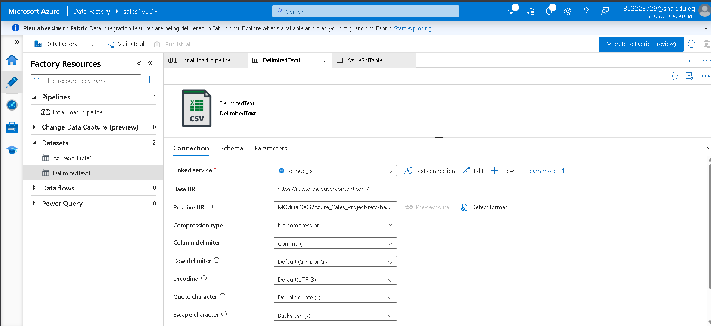
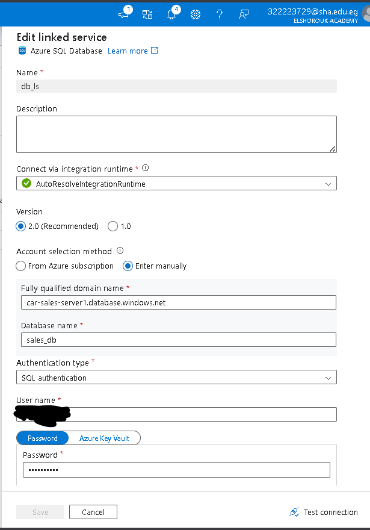
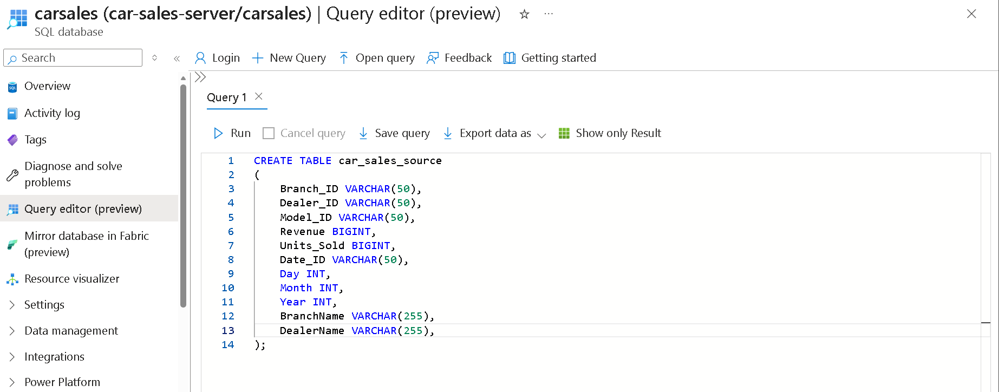
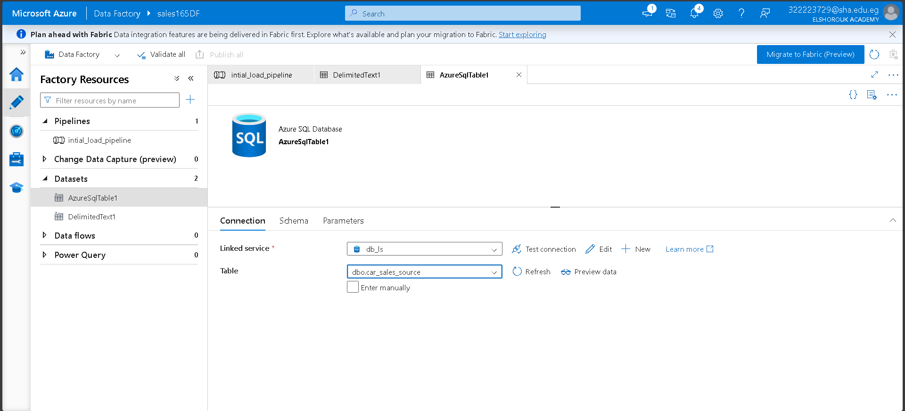
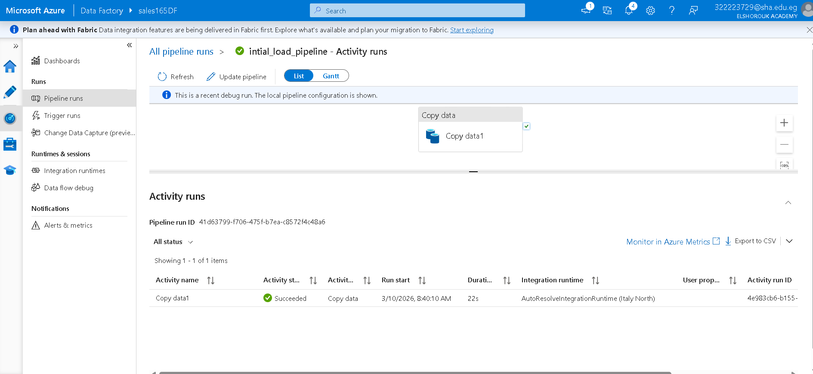
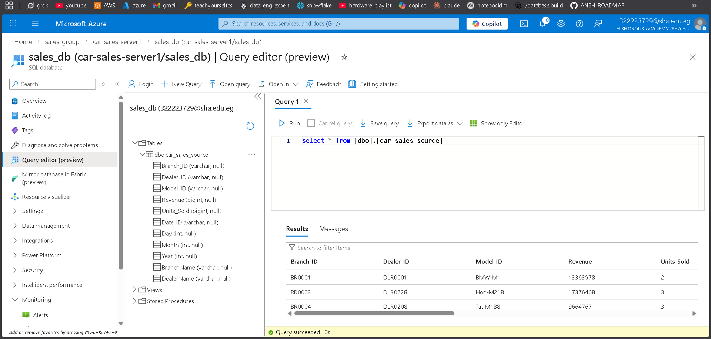

# Azure Sales Project

An end-to-end Azure data engineering project that ingests raw sales data, loads it into an Azure SQL database, processes it through a bronze/silver/gold-style pipeline in Databricks, and builds a star-schema model with fact and dimension tables.

---

## Project Overview

This project demonstrates a full data engineering workflow for sales analytics:

1. **Initial load** of source CSV data into **Azure SQL Database** using **Azure Data Factory**.
2. **Incremental ingestion** using a watermark-based pipeline.
3. **Bronze / Silver / Gold transformation layers** in **Databricks / PySpark**.
4. Creation of a final **sales analytical model** with:

   * `Fact_Sales`
   * `Dim_Branch`
   * `Dim_Dealer`
   * `Dim_Model`
   * `Dim_Date`

The goal is to turn raw operational sales data into a clean analytics-ready structure for reporting and dashboarding.

---

## Architecture

The pipeline follows a clear data flow:

**GitHub CSV files → Azure Data Factory → Azure SQL Database → Databricks Silver Layer → Databricks Gold Layer → Analytics Model**

At a high level:

* **GitHub** stores the source CSV files.
* **Azure Data Factory** copies the source data into Azure SQL for the initial load.
* A **watermark table** tracks the latest processed value for incremental loading.
* **Databricks notebooks** read the refined data, transform it, and write the final tables.

---

## What Was Built

### 1) Source Data and Initial Load

The repository includes source files inside `Raw_Data`:

* `SalesData.csv`
* `IncrementalSales.csv`

For the first load, a SQL table named **`car_sales_source`** was created with columns such as:

* `Branch_ID`
* `Dealer_ID`
* `Model_ID`
* `Revenue`
* `Units_Sold`
* `Date_ID`
* `Day`
* `Month`
* `Year`
* `BranchName`
* `DealerName`

The initial-load pipeline in Azure Data Factory uses:

* a **GitHub linked service** as the source
* an **Azure SQL Database linked service** as the sink
* a **Copy Data** activity to move the data

### 2) Incremental Load Strategy

To support refreshes after the initial load, the project uses a **watermark table** and a **stored procedure**.

The incremental pipeline:

* reads the **last load** value from the watermark table
* gets the **current load** value
* copies only the new records
* updates the watermark using a stored procedure

This makes the pipeline scalable and avoids reloading the same data repeatedly.

### 3) Silver Layer Transformation

In the silver notebook, the raw parquet data is read from ADLS Gen2 and cleaned for downstream processing.

Key transformations include:

* reading data from the bronze/raw path
* creating a new column `model_category` from `Model_ID`
* calculating `Revperunit` as `Revenue / Units_Sold`
* saving the transformed dataset into the silver layer path

### 4) Gold Layer Modeling

The gold notebooks create the final analytical model.

This includes:

* **Fact table** for sales measures
* **Dimension tables** for branch, dealer, model, and date
* incremental logic controlled through a Databricks widget called `incremental_flag`

The model is designed to support reporting, slicing, and aggregation by business dimensions.

---

## Notebook Structure

* `silver_notebook.ipynb` → prepares the silver layer data
* `gold_fact_sales.ipynb` → builds the fact table
* `gold_dim_branch.ipynb` → builds branch dimension
* `gold_dim_date.ipynb` → builds date dimension
* `gold_dim_dealer.ipynb` → builds dealer dimension
* `gold_dim_model.ipynb` → builds model dimension

---

## Technologies Used

* **Azure Data Factory**
* **Azure SQL Database**
* **Azure Databricks**
* **Apache Spark / PySpark**
* **Azure Data Lake Storage Gen2**
* **GitHub**
* **Jupyter Notebooks**

---

## Folder Structure

```text
Azure_Sales_Project/
├── Raw_Data/
│   ├── SalesData.csv
│   └── IncrementalSales.csv
├── images/
│   ├── DB_external_location.png
│   ├── DB_workflow.png
│   ├── creating_waermark_table.png
│   ├── incremental_pipline.png
│   ├── storage_credentail.png
│   ├── stored_procedure.png
│   ├── stored_procedure_activity.png
│   └── intial_load/
│       ├── creating_table.png
│       ├── db_linked_service.png
│       ├── db_sink.png
│       ├── github_linked_service.png
│       ├── github_source.png
│       ├── initial_load_db.png
│       └── table_after_initial_load.png
└── notebook/
    ├── silver_notebook.ipynb
    ├── gold_fact_sales.ipynb
    ├── gold_dim_branch.ipynb
    ├── gold_dim_date.ipynb
    ├── gold_dim_dealer.ipynb
    └── gold_dim_model.ipynb
```

---

## Detailed Pipeline Walkthrough

## 1. Initial Load Pipeline

The first pipeline loads the raw sales CSV from GitHub into Azure SQL Database.

### Source Linked Service

The source is connected through an HTTP linked service pointing to `raw.githubusercontent.com`.


### Source Dataset

The source dataset is configured as a delimited text file.



### SQL Linked Service

The sink is connected to the Azure SQL Database through a SQL linked service.



### SQL Table Creation

The target table `car_sales_source` is created with the required columns.



### Sink Dataset

The sink dataset points to the target SQL table.



### Pipeline Execution

The initial load pipeline runs successfully and copies the data into the SQL database.



### Loaded Table

After the load, the table contains the inserted sales records.



---

## 2. Incremental Load Pipeline

The incremental design avoids full reloads by using a watermark-based approach.

### External Location and Storage Credential

Databricks is connected to ADLS Gen2 through an external location and storage credential.


### Watermark and Stored Procedure

A watermark table is used to store the latest processed load value.
The stored procedure updates that watermark after a successful run.


### Incremental Pipeline Run

The pipeline reads the last watermark, loads only new data, and then updates the watermark.


---

## 3. Databricks Workflow

The Databricks job orchestrates the notebooks in the correct order:

1. `silver_notebook`
2. `gold_dim_branch`
3. `gold_dim_date`
4. `gold_dim_dealer`
5. `gold_dim_model`
6. `gold_fact_sales`

This creates the full analytical model in a single workflow.


---

## Silver Layer Logic

The silver notebook performs the first transformation pass.

### Main steps

* Read parquet data from the bronze/raw storage path
* Inspect schema and sample records
* Derive `model_category` from `Model_ID`
* Calculate `Revperunit`
* Write the cleaned data to the silver path

### Example transformation

```python
df = df.withColumn('model_category', split(col('Model_ID'), '-')[0])
df = df.withColumn('Revperunit', col('Revenue') / col('Units_Sold'))
```

This layer standardizes the data and prepares it for dimensional modeling.

---

## Gold Layer Logic

The gold layer converts the silver data into a star schema.

### Fact Table

`Fact_Sales` contains the measurable sales attributes used for analysis.

### Dimension Tables

* `Dim_Branch` for branch-level analysis
* `Dim_Dealer` for dealer-level analysis
* `Dim_Model` for car model analysis
* `Dim_Date` for time-based analysis

### Incremental Control

A Databricks widget named `incremental_flag` is used to switch between initial and incremental processing.

```python
dbutils.widgets.text('incremental_flag','0')
incremental_flag = dbutils.widgets.get('incremental_flag')
```

This allows the same notebook logic to support both first-time loads and subsequent updates.

---

## Business Value

This project helps answer questions like:

* Which branches generate the highest sales?
* Which dealers contribute the most revenue?
* Which car model categories perform best?
* How do sales change over time?
* What is the revenue per unit for each model?

The final model is ready for BI tools such as Power BI or other dashboarding platforms.

---

## Key Strengths

* End-to-end Azure pipeline design
* Clear separation between initial and incremental loading
* Medallion-style transformation approach
* Star-schema modeling for analytics
* Reusable Databricks notebooks
* Watermark-based incremental processing

---

## How to Run

1. Upload or store the raw data in the expected source location.
2. Create the Azure SQL table `car_sales_source`.
3. Configure the GitHub and SQL linked services in Azure Data Factory.
4. Run the **initial load pipeline**.
5. Create the ADLS Gen2 external location and storage credential in Databricks.
6. Run the **silver notebook**.
7. Run the **gold notebooks** to create the fact and dimension tables.
8. Use the **incremental pipeline** for new data arrivals.

---

## Notes

* The project uses a consistent sales domain across all layers.
* The notebook names and images clearly show the movement from raw ingestion to final modeling.
* The pipeline design is suitable for portfolio presentation and interview discussion.

---

## Author

**Mohamed Ahmed Diaa**

---

If you want this README adapted into a more professional portfolio version, I can turn it into a cleaner GitHub-ready Markdown layout with a stronger intro, a feature list, and a more polished “architecture” section.
